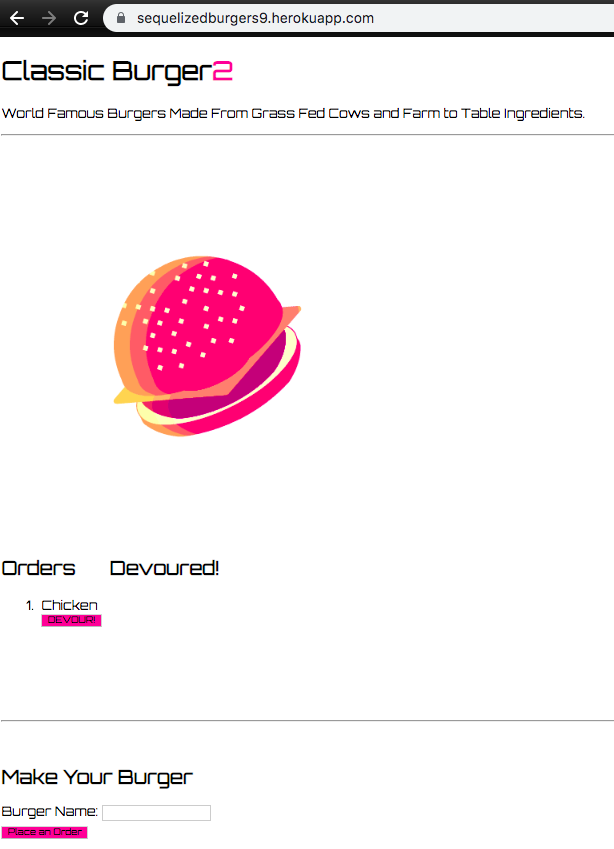
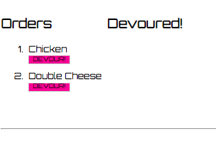
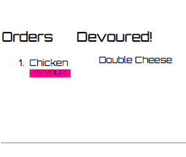

# Classic Burgers - Node and Express Servers

<br>

## Description

Classic Burgers is a logger that takes in orders from the user and shows an ordered list of orders to be completed. Burgers from the list can be devoured and moved to a seperate list using Sequelize queries.


<br>

## Overview of App Organization

This is app contains the following files:

  ```
  Burger
    - .gitignore
    - config
      - connection.js
      - db-config.js
    - controllers
      - burgers_controller.js
    - db
      - schema.sql
      - seeds.sql
    - models
      - burger.js
      - index.js
    - public
      - assets
        - css
          - burger_style.css
        -img
        - js
          - burger.js
    - views
      - layouts
        - main.handlebars
      - partials
        - index.handlebars
        - burgers
          - burger-block.handlebars
    - node_modules
    - package.json
    - server.js
  ```
  

<br>

## Run Instructions

The user begins at:



The user can fill out the **Burger Name** form, 




The burger name appears on the left side above the form until the **Devour** button is clicked



This moves the selected burger to the right column on the screen designated for devoured burgers

## This App Utilizes

   * [Node](https://nodejs.org/en/about/)

   * [Express](https://www.npmjs.com/package/express)

   * [Handlebars](https://handlebarsjs.com/)

   * [Sequelize](https://www.npmjs.com/package/sequelize)


<br>

## Role in Development

My name is Alex I am a bootcamp student whose portfolio can be found
[here]( https://alexsamalot19.github.io/Samalot-Alexander-Portfolio/).

I designed this app using existing APIs and packages listed in the **This App Utilizes** section. I used Node and Sequelize to query and route data in this app, and Handlebars to generate your HTML. The site is deployed to Heroku [here](https://sequelizedburgers9.herokuapp.com/).